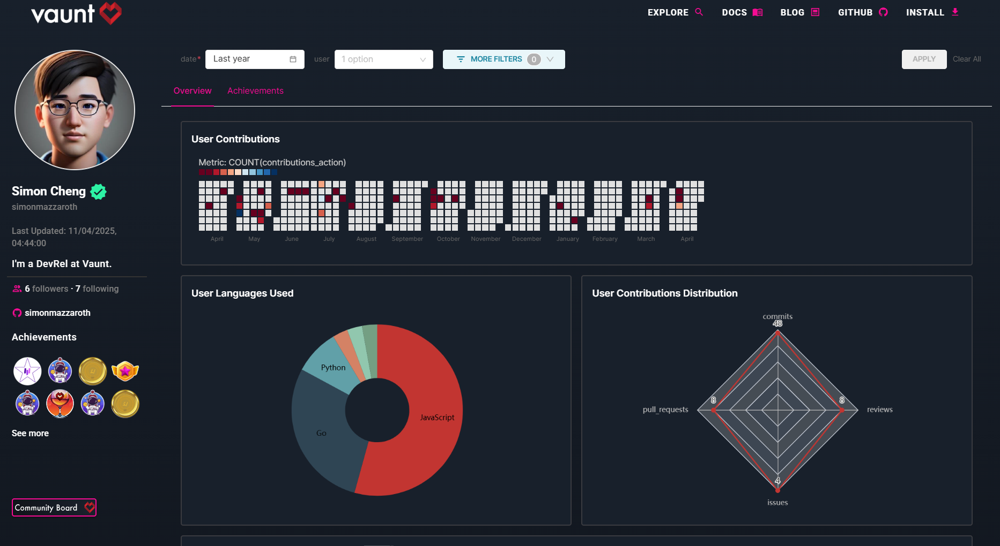

# Vaunt Community Boards

Vaunt Community Boards give developers a visual overview of their open-source activity, including contribution stats, and a view into repository achievements. They help you track your growth, and showcase your work across GitHub.

### How to Display Your Community Board in Your GitHub README

1. Add this code to your README file, replacing `{github_username}` with your GitHub username.

```html
[](https://community.vaunt.dev/board/{github_username})
```

Once you’ve added the board to your repository, a Vaunt badge will appear in your README file, like the example below:

<p>
    
</p>

Click the badge to open your community board.

Here’s a preview of what it looks like:


:::tip
We recommend installing Vaunt on all your repositories to ensure you accurately track your contributions. By default, all public contributions are counted.
:::
