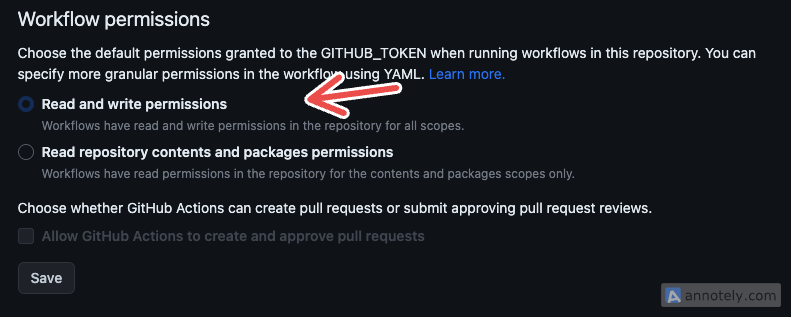

In this section, you'll learn how the [Vaunt Action](https://github.com/marketplace/actions/vaunt-cards-action) works, how we built it, and how you can integrate it into your own repositories, including private ones.

---

## Overview

Vaunt action is a [github action](https://docs.github.com/en/actions/learn-github-actions/understanding-github-actions) that is used to update the contributors card in your repository.
It will:

1. Make the API calls to Vaunt with optional authentication using a GitHub [personal Access Token](https://docs.github.com/en/authentication/keeping-your-account-and-data-secure/managing-your-personal-access-tokens)
2. Update the contributors card in your repository
3. Commit the card to an images directory e.g `.vaunt/cards`
4. Reference the card in your README

## How to Add Vaunt Action to Your Repository

To use the Vaunt Action:

1. Add the workflow file to your repository
2. Grant the workflow appropriate permissions:

   - Go to your repository's **Settings** → **Actions** → **General**
   - Scroll to the Workflow permissions section
   - Ensure *"Read and write permissions"* is selected



## How to Use Vaunt Action with Private Repositories

If you are using Vaunt Action on a private repository, you’ll need to generate a [GitHub Personal Access Token (PAT)](https://docs.github.com/en/authentication/keeping-your-account-and-data-secure/managing-your-personal-access-tokens) and provide it as a secret variable to the repository.

:::note
This is necessary to authenticate the workflow and verify your ownership or admin access to the repository.
:::

### How to Generate and Add the Personal Access Token(PAT)

1. Follow the instructions [here](https://docs.github.com/en/authentication/keeping-your-account-and-data-secure/managing-your-personal-access-tokens#creating-a-personal-access-token-classic) to create a GitHub Personal Access Token.

2. In your repository:
   - Go to Settings → **Secrets and variables** → Actions
     
   - Click `New repository secret`
     
   - Name your secret (e.g., `VAUNT_GITHUB_TOKEN`) and paste the token value

Your workflow file should reference this secret as a variable to the Vaunt Action:

```Yaml
  with:
    # Github Personal Access Token for private repositories
    token: ${{ secrets.PAT }}
```

## Automating Contributors Cards with Vaunt Action

This Vaunt action workflow is designed to update contributors' cards based on a set schedule or when manually triggered. It uses the `workflow_dispatch` event to manually trigger the workflow and a `cron schedule` to automatically trigger it at regular intervals.

### Workflow: Vaunt Cards Update

See the example Workflow below:

```Yaml
name: Vaunt Cards Update
on:
  workflow_dispatch:
  schedule:
  - cron: 30 * * * *

jobs:
  my_job:
    runs-on: ubuntu-latest

    steps:
    - name: Checkout
      uses: actions/checkout@v3
    - name: Update Vaunt Cards
      uses: VauntDev/vaunt-cards-action@main
      with:
        # Github Personal Access Token for private repositories
        token: ${{ secrets.PAT }}
        limit: 10
```

#### Explanation

- `workflow_dispatch`: Enables manual runs of the workflow directly from the GitHub UI. This is useful for testing or triggering updates on demand.

- `schedule` (cron: `30 * * * *`): Automatically runs the workflow every hour at 30 minutes past the hour. You can adjust this schedule as needed (see Cron Syntax).

:::note
The scheduled or manual trigger (`workflow_dispatch`) will only work if this workflow file is added to the default branch of your repository.
:::

- `jobs` Breakdown:

  1.  **Checkout the repository**: The job first checks out the current default branch of the repository using the actions/checkout action. This step ensures the workflow has access to the latest code and files.
  2.  **Update Vaunt Cards**: Next, the workflow runs the Vaunt Cards Action (VauntDev/vaunt-cards-action@main).
      This action:
      - Updates the contributors card located at .vaunt/cards/contributors.svg
      - Checks in the updated file back into the repository

:::tip
if you would prefer to keep your files in a separate , you can modify the `Checkout` step to pick a specific branch of your repository to checkout. For example, if you use an assets branch your Checkout step would look like this:

```Yaml
    - name: Checkout
      uses: actions/checkout@v3
      with: { ref: assets }
```

:::

There are two optional values you can configure for the `vaunt-cards-action`:

1. **`token`**: This is the GitHub Personal Access Token (PAT) used for authentication when running the action on a private repository. The token should be stored as a repository secret, as explained earlier in this guide.

2. **`limit`**: This sets the maximum number of contributors to include in the contributors card. By default, the value is `10`, but you can increase it to a maximum of `100` to display more contributors.

These values allow you to customize the behavior of the action based on your repository's needs.

## How to Display the Contributors' Cards

Once the workflow is set up and running, the `contributors.svg` card will be automatically updated and stored in your repository. You can display this card in your repository’s `README.md` file using one of the following methods:

1. **For the Default Branch (e.g., `main`)**  
   Use a simple Markdown image tag to reference the card:

   ```markdown
   
   ```

2. **For a Non-Main Branch**

   If the card is stored in a different branch, use the full GitHub URL to reference it:

   ```markdown
   ![Contributors] (https://github.com/<owner>/<repo>/blob/<branch>/.vaunt/cards/contributors.svg) // Replace <owner>, <repo>, and <branch> with your actual repository details
   ```

3. **Using an HTML Image Tag**

   For more control over the display (e.g., size), you can embed the card using an HTML `` tag:

   ```HTML
   <p>
       <a href="https://vaunt.dev">
           /<repo>/blog/<branch>/.vaunt/cards/contributors.svg" width="350" />  // Replace <owner>, <repo>, and <branch> with your actual repository details
       </a>
   </p>
   ```
