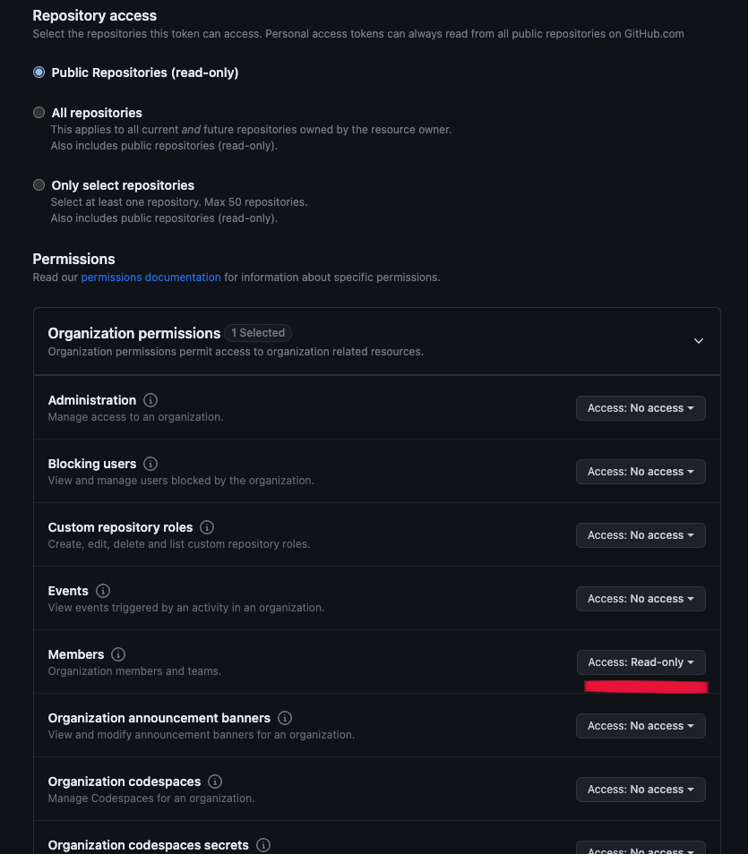

Some Vaunt API routes require Github authorization to verify your identity. After validating with a Github personal access token, you can generate a Vaunt JWT for future API calls.
This can be done on Github by creating and using a fine-grained Personal Access Token. See **[Creating a fine-grained personal access token](https://docs.github.com/en/authentication/keeping-your-account-and-data-secure/managing-your-personal-access-tokens#creating-a-fine-grained-personal-access-token)** for more information.

For user attestation, the token does not require any additional permissions or repository access. Vaunt only uses it to verify your Github user ID matches the entity.


To create a token for validating your organization admin status and retrieving data, generate an organization token with Read-only access to Members under the organization permissions. This access level allows Vaunt to verify your admin status through Github.



:::note
 Only organization administrators can create tokens for organization attestation.
:::

After generating a token you can use the token value with the `Authorization` header in requests to the Vaunt API.

Here's an example of a request to the Vaunt API using a Github PAT:

```bash
curl -v -H "content-type: application/json" -H "Authorization: Bearer <GITHUB_PAT>" http://api.vaunt.dev/v1/github/entities/<entity>/token
```
